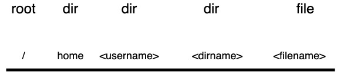

```
tree -L 1 /
```
Начало дерева - это корень, который обозначается символом прямого слэша (/). И именно тут располагается первая ФС (rootfs), куда собственно и устанавливается ОС, а затем с помощью операции монтирования присоединяются другие и получается вот такая структура. Например, /var может находиться на другом разделе диска или и вовсе на другом диске (типичное применение - вынос /var/lib/mysql [данные БД mysql] на отдельный диск и часто с более быстрой ФС). 

Давайте теперь поговорим про навигацию. Так как ФС у нас дерево, то от корня и до целевого файла/директории есть только один путь и он называется абсолютным. Например ```/home/<username>/<dir>/<file>```.
Все "узлы" в путях отделяются прямым слэшем. 


И существует еще относительный путь - это путь ОТНОСИТЕЛЬНО того места ФС, где вы сейчас находитесь. Давайте посмотрим на примере
```
cd /usr/local/bin
ls ../../local/lib/.././././bin
```
