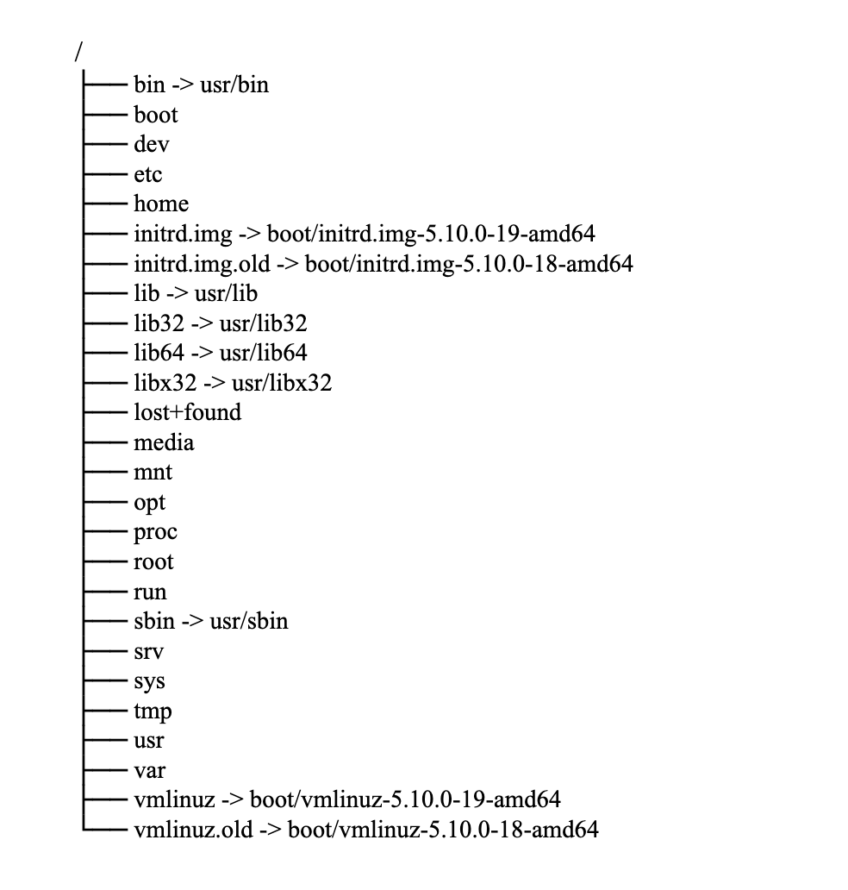
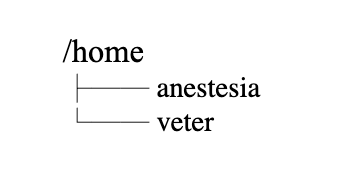
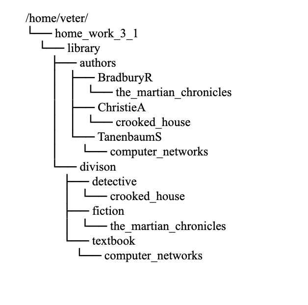
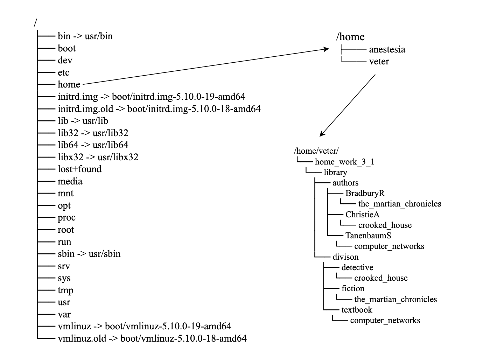
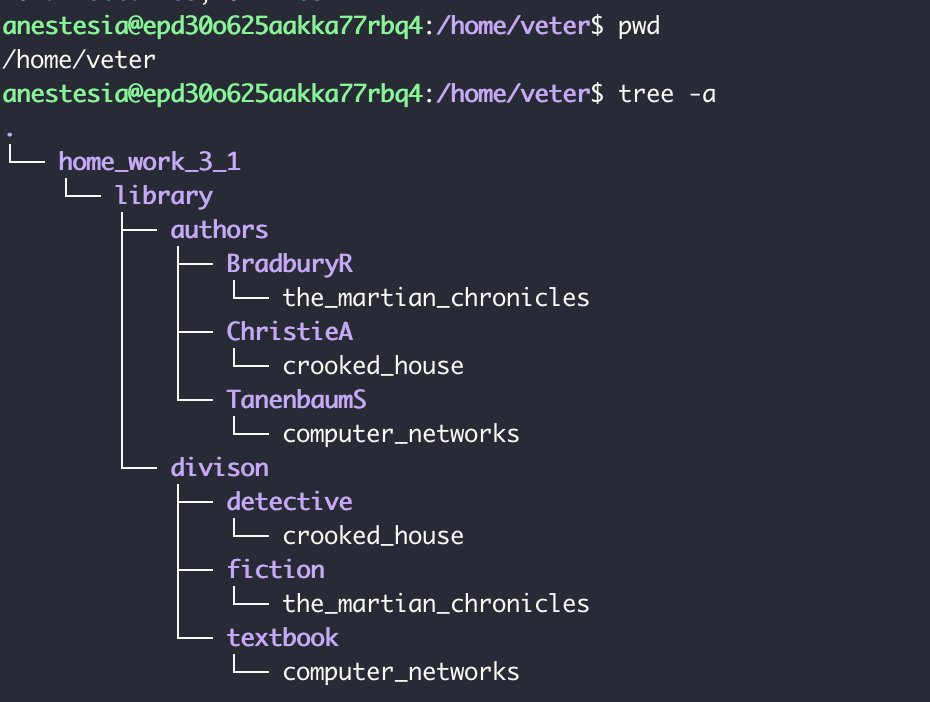

Файловая система (то, КАК *организовано* хранение информации в операционной системе) - дерево, у которого корень это символ слэша /, а все остальные директории и файлы - ветки.
```
tree -L 1 /
```
на твоем компе вывод команды будет немного отличаться, но это несущественно. Выглядит примерно так



Посмотрим на /home ```tree -L 1 /home```. home - директория, где находятся домашние директории пользователей (чтобы пользователи могли хранить там личные файлы, собственные программные настройки и пр.)



Заглянем в твою *домашнюю директорию* (/home/veter) ```tree -a /home/veter``` (я специально убрала archive, чтобы не загромождать). 



В твоей *домашней директории* уже есть home_work_3. Чтобы создать файл в *домашней директории* нужно выполнить команду  ```mkdir /home/veter/<folder-name>```, где <folder-name> это ИМЯ ДИРЕКТОРИИ, КОТОРОЕ ТЫ ХОЧЕШЬ ЗАДАТЬ (home_work_4, home_work_1, docs и тп). И такой способ адресации называется абсолютным, то есть ты прописываешь ВЕСЬ путь от / до имени папки или файла. Все "узлы" в путях отделяются прямым слэшем (никаких пробелов). 




И существует еще относительный путь - это путь ОТНОСИТЕЛЬНО того места ФС, где ты сейчас находишься. Как определить местоположение? Командой ```pwd```:
```
$ pwd
/home/veter
$ ls .
home_work_3_1
```
То есть ты находишься в своей *домашней директории*. Относительно твоего местоположения директория home_work_3 находится прям тут же (как кто-то сидящий в твоей комнате находится прям тут, не этажом выше, не этажом ниже, не за стенкой). Обозначается "прямо здесь" одной точкой. Посмотри на вывод ```tree -a``` и увидишь что начало - точка - место в котором выполнена команда



Теперь я перейду в home_work_3_1/library/authors/BradburyR/
```
$ pwd
/home/veter/home_work_3_1/library/authors/BradburyR
```
Относительно теперешнего местоположения где находится директория divison? На 2 уровня выше, наравне с authors. Уровень выше обозначается двумя точками (..). То есть чтобы попасть в divison (и неважно чем: cd, ls, mkdir, cp, mv, rm) мне нужно сделать так
```
$ pwd
/home/veter/home_work_3_1/library/authors/BradburyR
$ cd ../../divison/
$ pwd
/home/veter/home_work_3_1/library/divison
```

